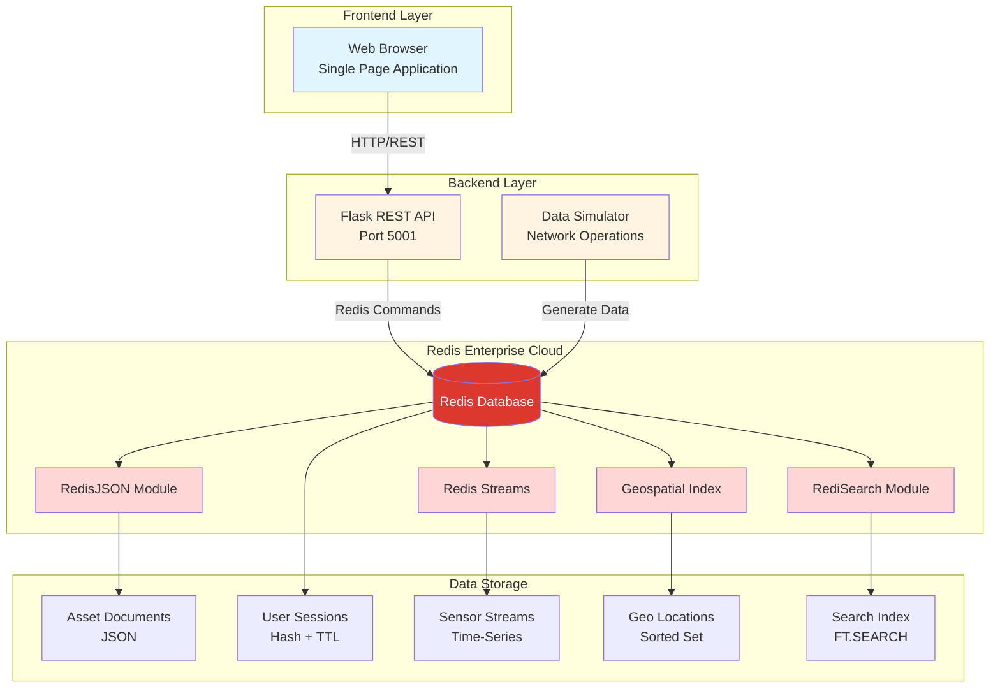
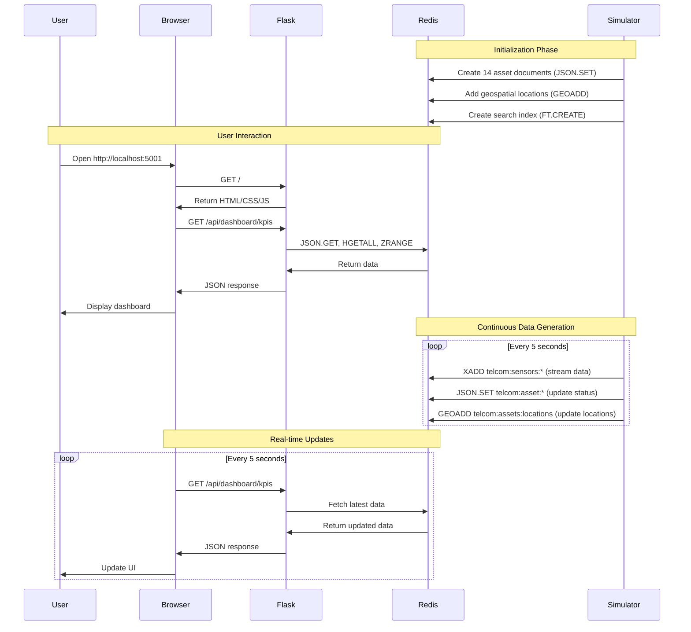

# 📡 Hello-Network Operations - Redis Enterprise Demo

<div align="center">


**A comprehensive real-time network operations demonstration showcasing Redis Enterprise capabilities for telecommunications infrastructure management**

[Quick Start](#-quick-start) • [Features](#-redis-features-demonstrated) • [Architecture](#-system-architecture) • [Demo](#-demo-features) • [Troubleshooting](#-troubleshooting)

</div>

---

## 📖 Project Overview

This demonstration application showcases the power of **Redis Enterprise** for mission-critical telecommunications network operations. Built as a **real-time network monitoring system**, it demonstrates how Redis can handle complex telecom infrastructure scenarios with:

- 🗺️ **Geospatial Asset Tracking** - Real-time location monitoring of 14+ network assets across a 100-mile radius
- 📡 **Edge-to-Core Data Streaming** - Continuous telemetry data ingestion using Redis Streams
- 🔍 **Full-Text Search** - Instant asset discovery with RediSearch
- 👥 **Session Management** - High-performance user session handling with TTL
- 📊 **Real-Time Analytics** - Live KPIs, alerts, and network operations dashboards
- 💾 **JSON Document Storage** - Flexible schema with RedisJSON


### 🎯 Use Case

Simulates a **Hello-Network Dallas-Fort Worth Metro Network** operation with:
- 14 distributed network assets (cell towers, base stations, routers, switches, fiber nodes, antennas, repeaters, service vehicles)
- Real-time telemetry data (signal strength, bandwidth, latency, packet loss, temperature, optical power, link quality)
- Geospatial tracking and proximity queries
- Network alerts and anomaly detection
- Multi-user session management

---

## 🚀 Quick Start

### One-Command Launch

```bash
./start_demo.sh
```

This automated script will:
- ✅ Clear existing Redis data for a fresh start
- ✅ Start the Flask backend server on port 5001
- ✅ Initialize the data simulator with 14 network assets
- ✅ Verify all services are running correctly
- ✅ Open the demo in your default browser

**Expected startup time:** ~15 seconds

---

## 🆕 Recent Improvements

### Backend Refactoring (Latest)

The backend has been completely refactored from a monolithic 1,280-line file into a modular, maintainable architecture using Flask Blueprints:

**✨ What's New:**
- 🏗️ **Modular Architecture** - Routes organized into 6 separate blueprint modules
- ⚡ **Performance Optimization** - Redis pipelining reduces asset loading from 7.6s to <1s (87% faster)
- 📦 **Better Organization** - Each feature area has its own module (dashboard, sensors, alerts, search, sessions, monitoring)
- 🔧 **Easier Maintenance** - Find and modify specific functionality quickly
- 📊 **Reduced Complexity** - Main app.py reduced from 1,280 to 531 lines

**📈 Performance Improvements:**
- **Asset Loading:** 7.6s → <1s (87% faster) using Redis pipelining
- **Network Calls:** Reduced from 29 sequential calls to 2 pipelined calls
- **Timeout Handling:** Graceful degradation with AbortController
- **Connection Pooling:** Efficient Redis connection reuse

### Frontend Refactoring (Previous)

The frontend was refactored from a single-page application into a multi-page application with shared components:

**✨ What Changed:**
- 🎨 **Multi-Page Architecture** - Separate HTML files for Dashboard, Sessions, and Search
- 🔄 **Shared Components** - Common CSS and JavaScript utilities
- 📱 **Better UX** - Faster page loads and improved navigation
- 🐛 **Bug Fixes** - Fixed alerts panel filtering and asset marker interactions

---

## 📋 Prerequisites

### Required Software

| Software | Version | Purpose |
|----------|---------|---------|
| **Python** | 3.8 or higher | Backend API and data simulator |
| **pip** | Latest | Python package management |
| **curl** | Any | API testing and verification |
| **Web Browser** | Modern (Chrome, Firefox, Safari) | Frontend interface |
| **Git** | Any | Repository cloning |

### Python Dependencies

Install all required packages:

```bash
pip install -r backend/requirements.txt
```

**Core dependencies:**
- `Flask==2.3.3` - Web framework for REST API
- `Flask-CORS==4.0.0` - Cross-origin resource sharing
- `redis==5.0.1` - Redis client library
- `requests==2.31.0` - HTTP library
- `python-dotenv==1.0.0` - Environment configuration
- `gunicorn==21.2.0` - Production WSGI server

### Redis Enterprise Requirements

You need access to a **Redis Enterprise Cloud** instance with the following modules enabled:

#### Required Redis Modules

| Module | Version | Purpose |
|--------|---------|---------|
| **RedisJSON** | 2.0+ | Store and query JSON documents |
| **RediSearch** | 2.0+ | Full-text search and indexing |
| **Redis Streams** | Built-in | Real-time data streaming |
| **Geospatial** | Built-in | Location-based queries |

#### Getting Redis Enterprise Cloud

1. **Sign up** for a free account at [Redis Cloud](https://redis.com/try-free/)
2. **Create a database** with the following settings:
   - Cloud Provider: AWS, GCP, or Azure
   - Region: Choose closest to your location
   - Modules: Enable **RedisJSON** and **RediSearch**
   - Memory: 30MB minimum (100MB recommended)
3. **Get credentials** from the database configuration page:
   - Endpoint (host and port)
   - Password

#### Setting Up Your Redis Credentials

You need to configure your Redis connection credentials:

1. **Copy the environment template:**
   ```bash
   cp .env.example .env
   ```

2. **Edit `.env` with your Redis credentials:**
   ```bash
   REDIS_HOST=your-redis-host.cloud.redislabs.com
   REDIS_PORT=12345
   REDIS_USERNAME=default
   REDIS_PASSWORD=your-password-here
   ```

> ⚠️ **Security Note:** Never commit the `.env` file to version control! It's already included in `.gitignore`.

#### Environment Variables Reference

All configuration is managed through the `.env` file:

| Variable | Description | Example |
|----------|-------------|---------|
| `REDIS_HOST` | Redis server hostname | `your-redis.cloud.redislabs.com` |
| `REDIS_PORT` | Redis server port | `16139` |
| `REDIS_USERNAME` | Redis username | `default` |
| `REDIS_PASSWORD` | Redis password | `your-secure-password` |
| `FLASK_RUN_PORT` | Backend server port | `5001` |
| `BACKEND_PORT` | Demo backend port | `5001` |

---

## 🔧 Step-by-Step Setup Instructions

### Step 1: Clone the Repository

```bash
# Clone the repository
git clone https://github.com/your-username/redis-telco-demo.git

# Navigate to the project directory
cd redis-telco-demo
```

### Step 2: Install Python Dependencies

```bash
# Install all required packages
pip install -r backend/requirements.txt

# Verify installation
python3 -c "import flask, redis, flask_cors; print('✅ All dependencies installed')"
```

### Step 3: Configure Redis Connection

1. **Copy the environment template:**
   ```bash
   cp .env.example .env
   ```

2. **Edit `.env` with your Redis Enterprise Cloud credentials:**
   ```bash
   # Open .env in your favorite editor
   nano .env
   # or
   vim .env
   # or
   code .env
   ```

3. **Update the following values:**
   ```bash
   REDIS_HOST=your-redis-host.cloud.redislabs.com
   REDIS_PORT=16139
   REDIS_USERNAME=default
   REDIS_PASSWORD=your-actual-password-here
   ```

> 💡 **Tip:** Get your Redis credentials from the Redis Cloud dashboard under "Database" → "Configuration"

### Step 4: Clear Redis Data (Fresh Start)

```bash
# The start_demo.sh script will automatically clear Redis data
# Or you can do it manually:
source .env
redis-cli -h "$REDIS_HOST" -p "$REDIS_PORT" -a "$REDIS_PASSWORD" FLUSHDB
```

**Expected output:**
```
OK
```

### Step 5: Start the Backend Server

Open a terminal and run:

```bash
cd backend
python3 app.py
```

**Expected output:**
```
✅ Connected to Redis Cloud at your-redis-host.cloud.redislabs.com:16139
 * Serving Flask app 'app'
 * Debug mode: on
 * Running on http://0.0.0.0:5001
```

> 💡 **Tip:** Keep this terminal open - you'll see API request logs here

### Step 6: Start the Data Simulator

Open a **new terminal** and run:

```bash
cd simulators
python3 field_data_simulator.py
```

**Expected output:**
```
✅ Connected to Redis Cloud at your-redis-host.cloud.redislabs.com:16139
✅ Initialized 14 network assets
✅ Created search index: idx:telcom:assets
🚀 Starting network data simulation...
📊 Generating telemetry data every 5 seconds...
```

> 💡 **Tip:** This simulator runs continuously, generating realistic network telemetry data

### Step 7: Access the Web Interface

Open your web browser and navigate to:

```
http://localhost:5001
```

You should see the **Hello-Network Operations Center** dashboard with:
- 🗺️ Interactive map showing network assets
- 📊 Real-time KPIs and metrics
- 🔔 Live network alerts
- 👥 Session management interface
- 🔍 Asset search functionality

---

## ✅ Verify Installation

Run these commands to verify everything is working correctly:

```bash
# Test Dashboard API
curl -s "http://localhost:5001/api/dashboard/kpis" | python3 -c "import sys, json; data=json.load(sys.stdin); print('✅ Dashboard:', len(data.get('kpis', [])), 'KPIs loaded')"

# Test Sessions API
curl -s "http://localhost:5001/api/sessions" | python3 -c "import sys, json; data=json.load(sys.stdin); print('✅ Sessions:', len(data.get('sessions', [])), 'active sessions')"

# Test Search API
curl -s "http://localhost:5001/api/search/assets?q=*&limit=3" | python3 -c "import sys, json; data=json.load(sys.stdin); print('✅ Search:', data.get('total', 0), 'assets indexed')"

# Test Frontend
curl -s "http://localhost:5001/" | grep -q "Hello-Network Operations" && echo "✅ Frontend: Serving correctly" || echo "❌ Frontend: Error"
```

**Expected Output:**
```
✅ Dashboard: 7 KPIs loaded
✅ Sessions: 30+ active sessions
✅ Search: 14 assets indexed
✅ Frontend: Serving correctly
```

---

## 🛑 Stopping the Demo

To cleanly stop all demo services:

```bash
./stop_demo.sh
```

This script will:
- ✅ Stop the Flask backend server
- ✅ Stop the data simulator
- ✅ Clean up all process IDs
- ✅ Optionally clear Redis data (you'll be prompted)

**Manual Stop (if needed):**
```bash
# Stop backend server
pkill -f "python.*app.py"

# Stop data simulator
pkill -f "field_data_simulator.py"

# Verify all processes stopped
ps aux | grep -E "app.py|field_data_simulator"
```

---

## 🔒 Security Best Practices

### Credential Management

This project uses **environment variables** to manage sensitive credentials securely:

✅ **What we do:**
- Store credentials in `.env` file (gitignored)
- Use `python-dotenv` to load environment variables
- Validate required credentials on startup
- Provide `.env.example` template for easy setup

❌ **What we DON'T do:**
- Hardcode credentials in source code
- Commit `.env` file to version control
- Share credentials in documentation
- Use default/weak passwords in production

### Setting Up Credentials Securely

1. **Never commit `.env` to Git:**
   ```bash
   # .env is already in .gitignore
   git status  # Should NOT show .env
   ```

2. **Use strong passwords:**
   - Generate strong passwords for Redis
   - Rotate credentials regularly
   - Use different credentials for dev/staging/production

3. **For production deployments:**
   - Use secrets management (AWS Secrets Manager, HashiCorp Vault, etc.)
   - Enable TLS/SSL for Redis connections
   - Use Redis ACLs for fine-grained access control
   - Enable VPC peering for network isolation

### Environment Variables

All sensitive configuration is managed through `.env`:

```bash
# Required
REDIS_HOST=your-redis-host.cloud.redislabs.com
REDIS_PORT=16139
REDIS_PASSWORD=your-secure-password

# Optional
REDIS_USERNAME=default
FLASK_RUN_PORT=5001
BACKEND_PORT=5001
```

---

## 🎯 Redis Features Demonstrated

This demo showcases **five core Redis Enterprise capabilities** essential for industrial IoT and real-time operations:

### 1. 🗺️ Geospatial Queries (Redis Geo)

**What it does:** Tracks real-time locations of network assets and performs proximity searches.

**How it's used in Telecommunications:**
- Store latitude/longitude coordinates for 14 network assets
- Find all assets within a specified radius (e.g., "all equipment within 50 miles of TOWER-001")
- Track mobile assets (service vehicles, mobile routers) as they move
- Optimize dispatch routing for network technicians

**Redis Commands Used:**
```redis
GEOADD telcom:assets:locations -96.7970 32.7767 "TOWER-001"
GEORADIUS telcom:assets:locations -96.7970 32.7767 50 mi WITHDIST
GEOPOS telcom:assets:locations "TOWER-001"
```

**Demo Feature:** Interactive map showing all network assets with click-to-view details

---

### 2. 📡 Redis Streams (Edge-to-Core Data Pipeline)

**What it does:** Ingests continuous telemetry data from network equipment in real-time.

**How it's used in Telecommunications:**
- Collect telemetry from network equipment (temperature, signal strength, bandwidth, latency)
- Buffer data at the edge before processing
- Maintain ordered time-series data streams
- Support multiple consumers for different analytics pipelines

**Redis Commands Used:**
```redis
XADD telcom:sensors:TOWER-001 * temperature 35.5 signal_strength -65 bandwidth 450
XREAD COUNT 100 STREAMS telcom:sensors:TOWER-001 0
XRANGE telcom:sensors:TOWER-001 - + COUNT 10
```

**Demo Feature:** Live telemetry readings updating every 5 seconds with historical stream data

---

### 3. 💾 RedisJSON (Flexible Document Storage)

**What it does:** Stores complex asset data as JSON documents with native querying.

**How it's used in Telecommunications:**
- Store comprehensive asset profiles (specifications, maintenance history, network configs)
- Update specific fields without retrieving entire documents
- Support nested data structures (location, connectivity, analytics)
- Enable schema flexibility for different asset types

**Redis Commands Used:**
```redis
JSON.SET telcom:asset:TOWER-001 $ '{"id":"TOWER-001","type":"cell_tower","status":"operational"}'
JSON.GET telcom:asset:TOWER-001 $.location
JSON.SET telcom:asset:TOWER-001 $.status "maintenance"
```

**Demo Feature:** Detailed asset information with nested properties and real-time updates

---

### 4. 🔍 RediSearch (Full-Text Search & Indexing)

**What it does:** Enables instant search across all asset properties with advanced filtering.

**How it's used in Telecommunications:**
- Search assets by name, type, manufacturer, location, or status
- Filter by multiple criteria (e.g., "all Ericsson cell towers in operational status")
- Autocomplete suggestions for asset discovery
- Aggregate and analyze asset data

**Redis Commands Used:**
```redis
FT.CREATE idx:telcom:assets ON JSON PREFIX 1 telcom:asset: SCHEMA $.id AS id TAG $.name AS name TEXT $.type AS type TAG
FT.SEARCH idx:telcom:assets "@type:{cell_tower} @status:{operational}"
FT.AGGREGATE idx:telcom:assets * GROUPBY 1 @type REDUCE COUNT 0 AS count
```

**Demo Feature:** Search tab with real-time filtering and autocomplete

---

### 5. 👥 Session Management (High-Performance TTL)

**What it does:** Manages user sessions with automatic expiration and real-time tracking.

**How it's used in Telecommunications:**
- Track network operators, engineers, and managers accessing the system
- Automatically expire inactive sessions for security
- Monitor concurrent users and session metrics
- Store session data (user info, preferences, last activity)

**Redis Commands Used:**
```redis
HSET telcom:session:abc123 user_id "operator-42" last_activity "2024-01-15T10:30:00Z"
EXPIRE telcom:session:abc123 3600
TTL telcom:session:abc123
KEYS telcom:session:*
```

**Demo Feature:** Session Management tab showing active sessions with TTL countdown

---

### 6. 📊 Real-Time Analytics (Sorted Sets & Hashes)

**What it does:** Maintains live KPIs, metrics, and operational statistics.

**How it's used in Telecommunications:**
- Track signal strength, bandwidth utilization, latency averages
- Maintain leaderboards (top performing towers, most active assets)
- Store time-series aggregations
- Calculate network efficiency metrics

**Redis Commands Used:**
```redis
ZADD telcom:bandwidth:daily 450.5 "TOWER-001" 380.2 "BASE-001"
ZREVRANGE telcom:bandwidth:daily 0 9 WITHSCORES
HINCRBY telcom:metrics:daily active_connections 285
```

**Demo Feature:** Dashboard KPIs with real-time updates and trend indicators

---

## 🗄️ Redis Data Structures

This section documents all Redis data types and key patterns used in the Hello-Network Operations demo application. Understanding these structures will help you explore the data in Redis and see how different modules work together.

### Overview of Data Types Used

| Data Type | Redis Module | Count | Purpose |
|-----------|--------------|-------|---------|
| **RedisJSON** | RedisJSON | 14 documents | Asset details and metadata |
| **Geospatial** | Built-in | 1 index | Asset location tracking |
| **Streams** | Built-in | 8+ streams | Sensor telemetry data |
| **Hashes** | Built-in | 8+ hashes | Latest sensor readings |
| **Sorted Sets** | Built-in | 3+ sets | Alerts, sessions, rankings |
| **Strings** | Built-in | 10+ keys | KPIs and metrics |
| **Search Index** | RediSearch | 1 index | Full-text asset search |

---

### 1. 💾 RedisJSON Documents

**Module Required:** RedisJSON 2.0+

**Key Pattern:** `telcom:asset:{asset_id}`

**Purpose:** Store comprehensive asset information as JSON documents with nested structures.

**Example Keys:**
- `telcom:asset:TOWER-001`
- `telcom:asset:RTR-ALPHA`
- `telcom:asset:BASE-001`
- `telcom:asset:SVC-001`

**Data Structure:**
```json
{
  "asset": {
    "id": "TOWER-001",
    "name": "Cell Tower Downtown-001",
    "type": "cell_tower",
    "group": "DFW Metro Network A",
    "model": {
      "manufacturer": "Ericsson",
      "model_number": "AIR-6488",
      "serial_number": "SN-87654321",
      "install_date": "2022-03-15"
    },
    "status": {
      "state": "active",
      "last_update": "2024-01-15T10:30:00Z",
      "health_score": 95,
      "runtime_hours": 5420
    },
    "location": {
      "latitude": 32.78,
      "longitude": -96.80,
      "elevation_ft": 650,
      "zone": "DFW Metro Zone 3",
      "region_code": "TX-DFW3"
    },
    "metrics": {
      "temperature_c": 35.3,
      "signal_strength_dbm": -65.0,
      "bandwidth_mbps": 450.2,
      "vibration_mm_s": 0.3,
      "power_kwh": 12.5,
      "active_connections": 285,
      "latency_ms": 12.5,
      "packet_loss_pct": 0.15
    },
    "maintenance": {
      "last_service_date": "2024-01-01",
      "next_service_due": "2024-04-01",
      "total_downtime_hours": 120,
      "last_fault": {
        "code": "E-542",
        "timestamp": "2024-01-10T08:15:00Z"
      },
      "maintenance_team": "Network Ops A",
      "contact": {
        "name": "John Doe",
        "email": "john.doe@hello-network.com"
      }
    },
    "connectivity": {
      "sensor_id": "SENSOR-TOWER001",
      "communication_status": "online",
      "data_source": "Modbus/TCP",
      "data_frequency": "5s",
      "last_data_received": "2024-01-15T10:29:55Z"
    },
    "analytics": {
      "avg_uptime_pct": 98.5,
      "maintenance_cost_to_date": 15420.50
    },
    "metadata": {
      "created_by": "system",
      "created_at": "2022-03-15T00:00:00Z",
      "updated_by": "Naresh Sanodariya",
      "version": "v1.3.2"
    }
  }
}
```

**Redis Commands:**
```redis
# Store complete asset document
JSON.SET telcom:asset:TOWER-001 $ '{"asset":{...}}'

# Get entire document
JSON.GET telcom:asset:TOWER-001

# Get specific field
JSON.GET telcom:asset:TOWER-001 $.asset.location.latitude

# Update specific field
JSON.SET telcom:asset:TOWER-001 $.asset.status.state "maintenance"

# Get multiple fields
JSON.GET telcom:asset:TOWER-001 $.asset.name $.asset.type $.asset.status
```

**Total Keys:** 14 (one per asset)

---

### 2. 🗺️ Geospatial Index

**Module Required:** Built-in (Redis Geo)

**Key Pattern:** `telcom:assets:locations`

**Purpose:** Track real-time latitude/longitude coordinates of all network assets for proximity queries.

**Data Structure:**
```
Sorted Set with geohash encoding:
Member: "TOWER-001"    → Coordinates: (-96.80, 32.78)
Member: "RTR-ALPHA"    → Coordinates: (-96.85, 32.67)
Member: "BASE-001"     → Coordinates: (-96.92, 32.45)
Member: "SVC-001"      → Coordinates: (-96.82, 32.82)
...
```

**Redis Commands:**
```redis
# Add asset location
GEOADD telcom:assets:locations -96.80 32.78 "TOWER-001"

# Get asset position
GEOPOS telcom:assets:locations "TOWER-001"
# Returns: ["-96.80", "32.78"]

# Find assets within radius
GEORADIUS telcom:assets:locations -96.80 32.78 50 mi WITHDIST WITHCOORD
# Returns all assets within 50 miles with distances and coordinates

# Find nearby assets
GEORADIUSBYMEMBER telcom:assets:locations "TOWER-001" 25 mi WITHDIST
# Returns assets within 25 miles of TOWER-001

# Get distance between assets
GEODIST telcom:assets:locations "TOWER-001" "RTR-ALPHA" mi
# Returns: "8.3" (miles)
```

**Total Keys:** 1 (contains all 14 asset locations)

---

### 3. 📡 Redis Streams (Telemetry Data)

**Module Required:** Built-in (Redis Streams)

**Key Pattern:** `telcom:sensors:{sensor_id}`

**Purpose:** Store time-series telemetry data as ordered streams for real-time monitoring and historical analysis.

**Example Keys:**
- `telcom:sensors:TEMP-001`
- `telcom:sensors:SIGNAL-001`
- `telcom:sensors:BAND-001`
- `telcom:sensors:VIB-001`

**Data Structure:**
```
Stream entries (time-ordered):
1704451200000-0 {
  "sensor_id": "SIGNAL-001",
  "timestamp": "1704451200.5",
  "temperature": "35.3",
  "signal_strength": "-65",
  "bandwidth": "450",
  "vibration": "0.3",
  "location": "TOWER-001"
}
1704451205000-0 {
  "sensor_id": "SIGNAL-001",
  "timestamp": "1704451205.5",
  "temperature": "35.8",
  "signal_strength": "-64",
  "bandwidth": "455",
  "vibration": "0.3",
  "location": "TOWER-001"
}
...
```

**Redis Commands:**
```redis
# Add telemetry reading to stream
XADD telcom:sensors:SIGNAL-001 * sensor_id SIGNAL-001 timestamp 1704451200.5 temperature 35.3 signal_strength -65 location TOWER-001

# Read latest entries
XREAD COUNT 10 STREAMS telcom:sensors:TEMP-001 0

# Read range of entries
XRANGE telcom:sensors:TEMP-001 - + COUNT 100

# Get stream length
XLEN telcom:sensors:TEMP-001

# Read from multiple streams
XREAD COUNT 5 STREAMS telcom:sensors:TEMP-001 telcom:sensors:PRESS-001 0 0

# Trim old entries (keep last 1000)
XTRIM telcom:sensors:TEMP-001 MAXLEN ~ 1000
```

**Total Keys:** 8+ (one per sensor type)

---

### 4. 🔢 Hashes (Latest Sensor Readings)

**Module Required:** Built-in (Redis Hashes)

**Key Pattern:** `telcom:sensor:latest:{sensor_id}`

**Purpose:** Store the most recent sensor reading for quick access without scanning streams.

**Example Keys:**
- `telcom:sensor:latest:TEMP-001`
- `telcom:sensor:latest:PRESS-001`
- `telcom:sensor:latest:FLOW-001`
- `telcom:sensor:latest:VIB-001`

**Data Structure:**
```
Hash fields:
sensor_id: "TEMP-001"
timestamp: "1704451200.5"
temperature: "85.3"
pressure: "0"
flow_rate: "0"
vibration: "0"
location: "RTR-ALPHA"
```

**Redis Commands:**
```redis
# Set all fields at once
HSET telcom:sensor:latest:TEMP-001 sensor_id TEMP-001 timestamp 1704451200.5 temperature 35.3 location TOWER-001

# Get all fields
HGETALL telcom:sensor:latest:TEMP-001

# Get specific field
HGET telcom:sensor:latest:TEMP-001 temperature

# Get multiple fields
HMGET telcom:sensor:latest:TEMP-001 temperature pressure vibration

# Update single field
HSET telcom:sensor:latest:TEMP-001 temperature 36.1

# Check if field exists
HEXISTS telcom:sensor:latest:TEMP-001 temperature
```

**Total Keys:** 8+ (one per sensor)

---

### 5. 📊 Sorted Sets (Alerts & Sessions)

**Module Required:** Built-in (Redis Sorted Sets)

**Key Pattern:** `telcom:alerts:active`, `telcom:sessions:active`, `redis:commands:{context}`

**Purpose:** Maintain ordered collections with scores for ranking, time-based ordering, and leaderboards.

#### A. Active Alerts

**Key:** `telcom:alerts:active`

**Data Structure:**
```
Sorted Set (score = timestamp):
Score: 1704451200.5  Member: '{"id":"TEMP_HIGH_TEMP-001_1704451200","type":"temperature_high","message":"High Temperature Detected","details":"55°C exceeds normal operating range","location":"RTR-ALPHA","sensor_id":"TEMP-001","severity":"warning","timestamp":1704451200.5}'

Score: 1704451205.8  Member: '{"id":"LATENCY_HIGH_LAT-001_1704451205","type":"latency_high","message":"High Latency Detected","details":"45ms exceeds normal operating range","location":"RTR-ALPHA","sensor_id":"LAT-001","severity":"high","timestamp":1704451205.8}'
...
```

**Redis Commands:**
```redis
# Add alert
ZADD telcom:alerts:active 1704451200.5 '{"id":"TEMP_HIGH_...","message":"High Temperature",...}'

# Get recent alerts (newest first)
ZREVRANGE telcom:alerts:active 0 9 WITHSCORES

# Get alerts in time range
ZRANGEBYSCORE telcom:alerts:active 1704451000 1704452000

# Count alerts
ZCARD telcom:alerts:active

# Remove old alerts (keep last 50)
ZREMRANGEBYRANK telcom:alerts:active 0 -51

# Get alert by rank
ZREVRANGE telcom:alerts:active 0 0
```

#### B. Active Sessions

**Key:** `sessions:active`

**Data Structure:**
```
Sorted Set (score = last_activity_timestamp):
Score: 1704451200.5  Member: "telcom:session:abc123def456"
Score: 1704451205.8  Member: "telcom:session:xyz789ghi012"
...
```

**Redis Commands:**
```redis
# Add session
ZADD telcom:sessions:active 1704451200.5 telcom:session:abc123def456

# Get active sessions
ZRANGE sessions:active 0 -1 WITHSCORES

# Remove expired sessions
ZREMRANGEBYSCORE sessions:active 0 1704447600

# Count active sessions
ZCARD sessions:active
```

#### C. Redis Command Monitoring

**Key Pattern:** `redis:commands:{context}`

**Purpose:** Track Redis commands executed for monitoring and debugging.

**Example Keys:**
- `redis:commands:geospatial`
- `redis:commands:session`
- `redis:commands:search`

**Total Keys:** 3+ sorted sets

---

### 6. 🔤 Strings (KPIs & Metrics)

**Module Required:** Built-in (Redis Strings)

**Key Pattern:** `telcom:metrics:{metric_name}`, `telcom:system:{property}`, `telcom:alerts:count`

**Purpose:** Store simple scalar values for dashboard KPIs and system metrics.

**Example Keys:**
- `telcom:metrics:avg_temperature`
- `telcom:metrics:avg_pressure`
- `telcom:metrics:total_production`
- `telcom:system:uptime`
- `telcom:alerts:count`

**Data Structure:**
```
Key: telcom:metrics:avg_temperature    Value: "85.7"
Key: telcom:metrics:avg_pressure       Value: "2450.3"
Key: telcom:metrics:total_production   Value: "9250"
Key: telcom:system:uptime              Value: "1704451200"
Key: telcom:alerts:count               Value: "42"
```

**Redis Commands:**
```redis
# Set metric value
SET telcom:metrics:avg_temperature 85.7

# Get metric value
GET telcom:metrics:avg_temperature

# Increment counter
INCR telcom:alerts:count

# Increment by amount
INCRBY telcom:metrics:total_production 150

# Set with expiration
SETEX telcom:metrics:temp_cache 3600 "85.7"

# Get multiple values
MGET telcom:metrics:avg_temperature telcom:metrics:avg_pressure telcom:metrics:total_production

# Set multiple values
MSET telcom:metrics:avg_temperature 85.7 telcom:metrics:avg_pressure 2450.3
```

**Total Keys:** 10+ string keys

---

### 7. 👥 Hashes (User Sessions)

**Module Required:** Built-in (Redis Hashes)

**Key Pattern:** `telcom:session:{session_id}`

**Purpose:** Store user session data with automatic expiration (TTL) for security and resource management.

**Example Keys:**
- `telcom:session:abc123def456ghi789`
- `telcom:session:xyz789abc123def456`

**Data Structure:**
```
Hash fields:
session_id: "abc123def456ghi789"
user_id: "operator-42"
username: "John Doe"
role: "Network Operator"
email: "john.doe@hello-network.com"
login_time: "2024-01-15T10:00:00Z"
last_activity: "2024-01-15T10:30:00Z"
ip_address: "192.168.1.100"
user_agent: "Mozilla/5.0..."
```

**Redis Commands:**
```redis
# Create session with all fields
HSET telcom:session:abc123 session_id abc123 user_id operator-42 username "John Doe" role "Network Operator"

# Set TTL (auto-expire after 1 hour)
EXPIRE telcom:session:abc123 3600

# Get all session data
HGETALL telcom:session:abc123

# Update last activity
HSET telcom:session:abc123 last_activity "2024-01-15T10:35:00Z"

# Refresh TTL
EXPIRE telcom:session:abc123 3600

# Check remaining TTL
TTL telcom:session:abc123

# Delete session (logout)
DEL telcom:session:abc123
```

**Total Keys:** 30+ (varies with active users)

---

### 8. 🔢 Hashes (Asset Metadata - Legacy)

**Module Required:** Built-in (Redis Hashes)

**Key Pattern:** `telcom:asset:{asset_id}` (for simple fields)

**Purpose:** Store simplified asset data as hashes for quick updates (used alongside RedisJSON for location updates).

**Example Keys:**
- `telcom:asset:TOWER-001`
- `telcom:asset:SVC-001` (service vehicle)

**Data Structure:**
```
Hash fields:
id: "SVC-001"
name: "Wireline Service Truck 001"
type: "service_truck"
status: "active"
latitude: "32.12"
longitude: "-102.45"
location: "SVC-001"
temperature: "75.5"
pressure: "0"
flow_rate: "0"
vibration: "1.2"
last_update: "2024-01-15T10:30:00Z"
```

**Redis Commands:**
```redis
# Update asset location (for mobile assets)
HSET telcom:asset:SVC-001 latitude 32.15 longitude -102.48 last_update "2024-01-15T10:31:00Z"

# Get asset data
HGETALL telcom:asset:SVC-001

# Update multiple fields
HMSET telcom:asset:SVC-001 latitude 32.15 longitude -102.48 status active

# Get specific fields
HMGET telcom:asset:SVC-001 latitude longitude status
```

**Note:** This is used for mobile assets (service vehicles) that need frequent location updates. Full asset details are stored in RedisJSON.

**Total Keys:** 2-3 (only for mobile assets)

---

### 9. 🔍 RediSearch Index

**Module Required:** RediSearch 2.0+

**Index Name:** `idx:telcom:assets`

**Purpose:** Enable full-text search and filtering across all asset JSON documents.

**Index Schema:**
```redis
FT.CREATE idx:telcom:assets
  ON JSON
  PREFIX 1 telcom:asset:
  SCHEMA
    $.asset.id AS id TAG
    $.asset.name AS name TEXT WEIGHT 2.0
    $.asset.type AS type TAG
    $.asset.status.state AS status TAG
    $.asset.model.manufacturer AS manufacturer TAG
    $.asset.location.zone AS zone TEXT
    $.asset.maintenance.maintenance_team AS team TAG
```

**Indexed Fields:**
- `id` - Asset ID (TAG for exact match)
- `name` - Asset name (TEXT for full-text search, weighted)
- `type` - Asset type (TAG for filtering)
- `status` - Operational status (TAG for filtering)
- `manufacturer` - Equipment manufacturer (TAG for filtering)
- `zone` - Geographic zone (TEXT for search)
- `team` - Maintenance team (TAG for filtering)

**Search Examples:**
```redis
# Search by name (full-text)
FT.SEARCH idx:telcom:assets "@name:production"

# Filter by type
FT.SEARCH idx:telcom:assets "@type:{cell_tower}"

# Multiple filters
FT.SEARCH idx:telcom:assets "@type:{router} @status:{active}"

# Search with wildcards
FT.SEARCH idx:telcom:assets "@name:tower*"

# Aggregate by type
FT.AGGREGATE idx:telcom:assets * GROUPBY 1 @type REDUCE COUNT 0 AS count

# Search with limit and offset
FT.SEARCH idx:telcom:assets "@manufacturer:{Ericsson}" LIMIT 0 10

# Get total count
FT.SEARCH idx:telcom:assets * LIMIT 0 0
```

**Index Statistics:**
```redis
# Get index info
FT.INFO idx:telcom:assets

# Returns:
# - Number of documents indexed: 14
# - Number of terms: ~150
# - Index size: ~50KB
# - Indexing status: AVAILABLE
```

**Total Indexes:** 1

---

### 📋 Complete Key Inventory

Here's a summary of all Redis keys used in the demo:

| Key Pattern | Type | Count | Example |
|-------------|------|-------|---------|
| `telcom:asset:{id}` | RedisJSON | 14 | `telcom:asset:TOWER-001` |
| `telcom:assets:locations` | Geospatial | 1 | `telcom:assets:locations` |
| `telcom:sensors:{sensor_id}` | Stream | 8+ | `telcom:sensors:TEMP-001` |
| `telcom:sensor:latest:{sensor_id}` | Hash | 8+ | `telcom:sensor:latest:TEMP-001` |
| `telcom:alerts:active` | Sorted Set | 1 | `telcom:alerts:active` |
| `telcom:sessions:active` | Sorted Set | 1 | `telcom:sessions:active` |
| `telcom:session:{session_id}` | Hash | 30+ | `telcom:session:abc123` |
| `telcom:metrics:{metric}` | String | 5+ | `telcom:metrics:avg_temperature` |
| `telcom:system:{property}` | String | 2+ | `telcom:system:uptime` |
| `telcom:alerts:count` | String | 1 | `telcom:alerts:count` |
| `redis:commands:{context}` | Sorted Set | 3+ | `redis:commands:geospatial` |
| `idx:telcom:assets` | Search Index | 1 | `idx:telcom:assets` |

**Total Approximate Keys:** 75-100 (varies with active sessions and sensor data)

---

### 🔧 Exploring Data in Redis

You can explore the data structures using Redis CLI or RedisInsight:

#### Using Redis CLI

```bash
# Connect to Redis
source .env
redis-cli -h "$REDIS_HOST" -p "$REDIS_PORT" -a "$REDIS_PASSWORD"

# List all keys
KEYS *

# Count keys by pattern
KEYS telcom:asset:* | wc -l
KEYS telcom:sensor:* | wc -l
KEYS telcom:session:* | wc -l

# View a JSON document
JSON.GET telcom:asset:TOWER-001

# View geospatial data
ZRANGE telcom:assets:locations 0 -1 WITHSCORES

# View stream data
XRANGE telcom:sensors:TEMP-001 - + COUNT 5

# View latest sensor reading
HGETALL telcom:sensor:latest:TEMP-001

# View active alerts
ZREVRANGE telcom:alerts:active 0 9

# View active sessions
ZRANGE sessions:active 0 -1

# Search assets
FT.SEARCH idx:telcom:assets "@type:{cell_tower}"

# Get metrics
MGET telcom:metrics:avg_temperature telcom:metrics:avg_signal_strength telcom:metrics:total_bandwidth
```

#### Using RedisInsight

1. Download RedisInsight from https://redis.io/insight/
2. Connect to your Redis Enterprise Cloud instance
3. Browse keys by pattern
4. View JSON documents with syntax highlighting
5. Execute search queries visually
6. Monitor streams in real-time
7. Analyze memory usage by key type

---

### 💡 Data Structure Best Practices

This demo follows Redis best practices:

1. **Use appropriate data types** - JSON for complex documents, Hashes for simple key-value, Streams for time-series
2. **Consistent key naming** - Use colons (`:`) as separators with namespace prefix, e.g., `telcom:asset:TOWER-001`
3. **Set TTLs for temporary data** - Sessions expire automatically after 1 hour
4. **Trim streams** - Keep only recent sensor data to manage memory
5. **Index for search** - Use RediSearch for complex queries instead of KEYS
6. **Denormalize data** - Store latest sensor readings in both Streams and Hashes for fast access
7. **Use Sorted Sets for rankings** - Alerts and sessions ordered by timestamp
8. **Atomic operations** - Use MULTI/EXEC for transactions when needed

---


## �️ System Architecture

### Architecture Diagram



### Component Overview

#### 🌐 Frontend (Multi-Page Application)
- **Technology:** Vanilla JavaScript, HTML5, CSS3
- **Architecture:** Modular multi-page application with shared components
- **Features:**
  - Three separate pages: Dashboard, Sessions, Search
  - Leaflet.js for interactive maps
  - Real-time data updates (5-second polling)
  - Responsive design for desktop and mobile
  - Optimized asset loading with timeout handling
- **Structure:**
  ```
  frontend/
  ├── dashboard.html          # Main operational dashboard
  ├── sessions.html           # User session management
  ├── search.html             # Asset search interface
  ├── css/
  │   └── styles.css          # Shared styles
  └── js/
      ├── common.js           # Shared utilities and API calls
      ├── dashboard.js        # Dashboard-specific logic
      ├── sessions.js         # Session management logic
      └── search.js           # Search functionality
  ```

#### ⚙️ Backend (Flask REST API with Blueprints)
- **Technology:** Python 3.8+, Flask 2.3, Flask-CORS
- **Architecture:** Modular blueprint-based organization
- **Port:** 5001
- **Responsibilities:**
  - Serve frontend HTML/CSS/JS files
  - Expose REST APIs organized by functionality
  - Manage Redis connections with connection pooling
  - Monitor Redis commands for demo purposes
  - Handle session lifecycle with TTL management
  - Optimize performance with Redis pipelining

- **Structure:**
  ```
  backend/
  ├── app.py                  # Main Flask application (531 lines)
  │   ├── RedisCommandMonitor # Command logging for demo
  │   ├── SessionManager      # User session management
  │   ├── Redis connection    # Enterprise Cloud connection
  │   └── Blueprint registry  # Route module registration
  └── routes/                 # Modular route blueprints
      ├── __init__.py         # Blueprint exports
      ├── dashboard.py        # Asset tracking & KPIs (357 lines)
      ├── sensors.py          # Sensor data streaming (159 lines)
      ├── alerts.py           # Alert management (56 lines)
      ├── search.py           # RediSearch functionality (145 lines)
      ├── sessions.py         # Session management (152 lines)
      └── monitoring.py       # Redis monitoring (70 lines)
  ```

- **Blueprint Organization:**

  **Dashboard Routes** (`routes/dashboard.py`)
  - `GET /api/assets` - Get all assets with **optimized pipelining** ⚡
  - `GET /api/assets/<id>` - Get specific asset details
  - `GET /api/assets/nearby` - Geospatial proximity queries
  - `POST /api/assets/<id>/update` - Update asset location
  - `GET /api/dashboard/kpis` - Dashboard-level KPIs
  - `GET /api/assets/<id>/kpis` - Asset-specific KPIs

  **Sensor Routes** (`routes/sensors.py`)
  - `POST /api/sensors/data` - Ingest sensor data via Redis Streams
  - `GET /api/sensors/<id>/stream` - Get sensor time-series data
  - `GET /api/sensors/active` - List all active sensors
  - `GET /api/assets/<id>/sensors` - Get sensors for specific asset

  **Alert Routes** (`routes/alerts.py`)
  - `GET /api/dashboard/alerts` - Get active alerts from sorted set

  **Search Routes** (`routes/search.py`)
  - `GET /api/search/assets` - Full-text search with RediSearch
  - `GET /api/search/suggestions` - Autocomplete suggestions

  **Session Routes** (`routes/sessions.py`)
  - `GET /api/sessions` - Get all active sessions
  - `POST /api/sessions` - Create new session
  - `GET /api/sessions/metrics` - Session statistics
  - `GET /api/assets/<id>/sessions` - Asset-specific sessions
  - `DELETE /api/sessions/<id>` - Delete session

  **Monitoring Routes** (`routes/monitoring.py`)
  - `GET /api/redis/commands` - Get recent Redis commands
  - `POST /api/redis/commands/clear` - Clear command history
  - `GET /api/redis/stats` - Get Redis command statistics

- **Performance Optimizations:**
  - ⚡ **Redis Pipelining** - Batch multiple commands to reduce network latency
    - `/api/assets` endpoint: Reduced from 29 sequential calls to 2 pipelined calls
    - **87% faster** - Response time improved from ~7.6s to <1s
  - 🔄 **Connection Pooling** - Reuse Redis connections efficiently
  - ⏱️ **Timeout Handling** - Graceful degradation with AbortController
  - 📦 **Dependency Injection** - Blueprints receive Redis client and monitor instances

#### 📊 Data Simulator
- **Technology:** Python 3.8+, Redis client
- **Responsibilities:**
  - Initialize 14 network assets on startup
  - Generate realistic sensor data every 5 seconds
  - Simulate asset movements and status changes
  - Create operational alerts and anomalies
  - Populate Redis Streams with telemetry
- **Location:** `simulators/field_data_simulator.py`
- **Asset Types:**
  - Cell Towers (3)
  - Base Stations (2)
  - Routers (3)
  - Switches (2)
  - Fiber Nodes (2)
  - Antennas, Repeaters, Service Vehicles

#### 🗄️ Redis Enterprise Cloud
- **Modules Required:**
  - **RedisJSON 2.0+** - JSON document storage
  - **RediSearch 2.0+** - Full-text search indexing
- **Built-in Features:**
  - Redis Streams - Time-series data
  - Geospatial - Location queries
  - Hashes - Session storage
  - Sorted Sets - Rankings and scores
  - TTL - Automatic expiration

### Data Flow



---

## 🎮 Demo Features

### 📊 Dashboard Tab

**What you'll see:**

1. **Real-Time KPIs (7 metrics)**
   - � Average Signal Strength: Network-wide signal quality (dBm)
   - 🌡️ Average Temperature: Equipment temperature monitoring (°C)
   - � Total Bandwidth: Combined network bandwidth (Mbps)
   - � Active Connections: Total active network connections
   - ⚠️ Active Alerts: Current operational warnings
   - ✅ Operational Assets: Assets in working condition
   - 📍 Total Assets: Complete asset inventory

2. **Interactive Geospatial Map**
   - 🗺️ Leaflet.js map centered on Dallas-Fort Worth Metro Area
   - 📍 14 asset markers color-coded by type:
     - 🔵 Blue: Cell towers and base stations
     - 🟢 Green: Routers and switches
     - 🔴 Red: Fiber nodes and antennas
     - 🟡 Yellow: Repeaters and service vehicles
   - 🖱️ Click any marker to view detailed asset information
   - 🔍 Zoom and pan to explore the network

3. **Live Operational Alerts**
   - ⚠️ Real-time alerts with severity levels (warning, critical)
   - 🕐 Timestamp for each alert
   - 📝 Detailed alert messages (signal degradation, high latency, equipment temperature)
   - 🔄 Auto-refresh every 5 seconds

4. **Asset Details Panel**
   - Click any map marker to see:
     - Asset ID and name
     - Type and manufacturer (Ericsson, Nokia, Samsung, Cisco)
     - Current status (operational, maintenance, offline)
     - Location coordinates
     - Latest network metrics (signal strength, bandwidth, latency, packet loss)
     - Maintenance schedule

**Screenshot Placeholder:**
```
[Dashboard showing KPIs, map with 14 assets, and live alerts panel]
```


---

### 👥 Session Management Tab

**What you'll see:**

1. **Active Sessions Table**
   - 👤 User ID and session ID
   - 🕐 Last activity timestamp
   - ⏱️ Time-to-live (TTL) countdown
   - 📊 Session data (user role, permissions)
   - 🔄 Real-time updates as sessions expire

2. **Session Metrics**
   - 📈 Total active sessions
   - ⏰ Average session duration
   - 🔄 Session creation rate
   - ❌ Expired sessions count

3. **Redis Commands Monitor**
   - 📝 Live log of Redis commands executed
   - 🏷️ Command categorization (read/write/other)
   - ⏱️ Timestamp for each command
   - 🎯 Context (dashboard, session, search)
   - 📊 Command statistics and counts

**How it demonstrates Redis:**
- **Hash data structure** for session storage
- **TTL (Time-To-Live)** for automatic expiration
- **KEYS pattern matching** to find all sessions
- **High-performance reads** for session validation

**Screenshot Placeholder:**
```
[Session management interface showing active sessions with TTL countdown and Redis command log]
```

---

### 🔍 Search Network Assets Tab

**What you'll see:**

1. **Search Bar with Autocomplete**
   - 🔍 Type to search across all asset properties
   - 💡 Smart suggestions as you type
   - ⚡ Instant results (sub-millisecond queries)

2. **Advanced Filters**
   - 🏷️ Asset Type: Filter by cell tower, router, base station, etc.
   - 📊 Status: Operational, maintenance, offline
   - 📍 Location: Search by region or coordinates
   - 🏭 Manufacturer: Ericsson, Nokia, Samsung, Cisco

3. **Search Results**
   - 📋 Comprehensive asset information
   - 📍 Geolocation data
   - 🔧 Technical specifications
   - 📊 Network metrics (signal strength, bandwidth, latency)
   - 🕐 Last updated timestamp

4. **Result Statistics**
   - 📊 Total results found
   - ⏱️ Query execution time
   - 🎯 Relevance scoring

**How it demonstrates Redis:**
- **RediSearch FT.SEARCH** for full-text queries
- **JSON path queries** for nested data
- **Tag fields** for exact-match filtering
- **Text fields** for fuzzy matching
- **Aggregations** for statistics

**Example Searches:**
```
"cell_tower"           → Find all cell tower assets
"Ericsson"             → Find all Ericsson equipment
"operational"          → Find all operational assets
"TOWER-001"            → Find specific tower
"@type:{router}"       → Advanced tag search
```

**Screenshot Placeholder:**
```
[Search interface showing search bar, filters, and results with asset details]
```

## 📊 Demo Data Overview

### Asset Inventory (14 Total Assets)

| Asset Type | Count | Asset IDs | Purpose |
|------------|-------|-----------|---------|
| **Cell Towers** | 3 | TOWER-001, TOWER-002, TOWER-003 | Primary wireless coverage |
| **Base Stations** | 2 | BASE-001, BASE-002 | Mobile network connectivity |
| **Routers** | 3 | RTR-ALPHA, RTR-BETA, RTR-GAMMA | Network routing |
| **Switches** | 2 | SW-001, SW-002 | Network switching |
| **Fiber Nodes** | 2 | FIBER-001, FIBER-002 | Fiber optic distribution |
| **Antennas** | 1 | ANT-001 | Signal transmission |
| **Repeaters** | 1 | REP-001 | Signal amplification |
| **Service Vehicles** | 1 | SVC-001 | Mobile maintenance |

### Geographic Coverage

- **Region:** Dallas-Fort Worth Metro Area
- **Center Point:** 32.7767°N, -96.7970°W
- **Coverage Radius:** ~50 km (0.5 degrees lat/lon)
- **Asset Distribution:** Realistic network layout across the metro area
- **Real-time Tracking:** GPS coordinates updated every 5 seconds for mobile assets (service vehicles)

### Network Metrics Generated

Each asset generates realistic telemetry:

| Metric Type | Range | Update Frequency | Purpose |
|-------------|-------|------------------|---------|
| **Signal Strength** | -90 to -40 dBm | 5 seconds | Network quality monitoring |
| **Bandwidth** | 50-5000 Mbps | 5 seconds | Throughput tracking |
| **Latency** | 5-50 ms | 5 seconds | Network performance |
| **Packet Loss** | 0.01-2.0% | 5 seconds | Connection quality |
| **Temperature** | 20-55°C | 5 seconds | Equipment health monitoring |
| **Active Connections** | 30-500 | 5 seconds | Load monitoring |
| **Optical Power** | -15 to -5 dBm | 5 seconds | Fiber link quality |
| **Link Quality** | 85-99.9% | 5 seconds | Connection reliability |

### Manufacturers Represented

- **Ericsson** - Cell towers, base stations, routers
- **Nokia** - Base stations, switches, fiber nodes
- **Samsung** - Cell towers, antennas, repeaters
- **Cisco** - Routers, switches, network equipment

---

## 🔧 Troubleshooting

### Common Issues and Solutions

#### 1. 🚫 Port 5001 Already in Use

**Symptom:** Error message "Address already in use" when starting backend

**Solution:**
```bash
# Find and kill the process using port 5001
lsof -ti:5001 | xargs kill -9

# Or use a different port by editing backend/app.py (line 1220)
# Change: app.run(host='0.0.0.0', port=5001, debug=True)
# To:     app.run(host='0.0.0.0', port=5002, debug=True)
```

---

#### 2. ❌ Redis Connection Failed

**Symptom:** "Failed to connect to Redis Cloud" error

**Possible Causes & Solutions:**

**A. Invalid Credentials**
```bash
# Test connection manually
source .env
redis-cli -h "$REDIS_HOST" -p "$REDIS_PORT" -a "$REDIS_PASSWORD" PING

# Expected output: PONG
```

**B. Network/Firewall Issues**
- Check if your network allows outbound connections on port 16139
- Try from a different network (e.g., mobile hotspot)
- Verify no corporate firewall is blocking Redis Cloud

**C. Missing Redis Modules**
```bash
# Check if RedisJSON and RediSearch are enabled
redis-cli -h <host> -p <port> -a <password> MODULE LIST

# Expected output should include:
# 1) 1) "name"
#    2) "ReJSON"
# 2) 1) "name"
#    2) "search"
```

---

#### 3. 📭 No Data Showing in Demo

**Symptom:** Dashboard shows 0 assets, empty map, no KPIs

**Solution:**
```bash
# Step 1: Verify data simulator is running
ps aux | grep field_data_simulator.py

# Step 2: Check Redis for data
redis-cli -h <host> -p <port> -a <password> KEYS telcom:asset:*

# Step 3: Restart data simulator
cd simulators
python3 field_data_simulator.py

# Step 4: If still no data, clear and reinitialize
./start_demo.sh
```

---

#### 4. 🌐 Frontend Not Loading

**Symptom:** Blank page or "Cannot GET /" error

**Solution:**
```bash
# Step 1: Verify backend is running
curl http://localhost:5001/

# Step 2: Check if frontend file exists
ls -la frontend/index.html

# Step 3: Check backend logs for errors
tail -f backend.log

# Step 4: Clear browser cache and hard refresh
# Chrome/Firefox: Ctrl+Shift+R (Windows) or Cmd+Shift+R (Mac)

# Step 5: Try different browser or incognito mode
```

---

#### 5. 🔍 Search Not Working

**Symptom:** Search returns no results or "Index not found" error

**Solution:**
```bash
# Step 1: Check if search index exists
redis-cli -h <host> -p <port> -a <password> FT._LIST

# Step 2: Recreate search index
redis-cli -h <host> -p <port> -a <password> << EOF
FT.CREATE idx:telcom:assets ON JSON PREFIX 1 telcom:asset: SCHEMA
  $.id AS id TAG
  $.name AS name TEXT
  $.type AS type TAG
  $.status AS status TAG
  $.manufacturer AS manufacturer TAG
EOF

# Step 3: Restart backend server
cd backend
python3 app.py
```

---

#### 6. ⚠️ Sessions API Hanging or Slow

**Symptom:** Session management tab takes forever to load

**Solution:**
```bash
# Step 1: Clear Redis command logs
curl -X POST http://localhost:5001/api/redis/commands/clear

# Step 2: Reduce number of sessions
redis-cli -h <host> -p <port> -a <password> KEYS "telcom:session:*" | xargs redis-cli -h <host> -p <port> -a <password> DEL

# Step 3: Restart backend server
```

---

#### 7. 🐌 Slow Performance / High Memory Usage

**Symptom:** Demo becomes sluggish over time

**Solution:**
```bash
# Step 1: Check Redis memory usage
redis-cli -h <host> -p <port> -a <password> INFO memory

# Step 2: Clear old stream data
redis-cli -h <host> -p <port> -a <password> KEYS "telcom:sensors:*" | xargs redis-cli -h <host> -p <port> -a <password> DEL

# Step 3: Restart data simulator
pkill -f field_data_simulator.py
cd simulators
python3 field_data_simulator.py

# Step 4: Clear all data and restart fresh
./start_demo.sh
```

---

#### 8. 🗺️ Map Not Displaying Assets

**Symptom:** Map loads but no markers appear

**Solution:**
```bash
# Step 1: Check if geospatial data exists
redis-cli -h <host> -p <port> -a <password> GEOPOS telcom:assets:locations TOWER-001

# Step 2: Verify API returns asset data
curl http://localhost:5001/api/assets | python3 -m json.tool

# Step 3: Check browser console for JavaScript errors
# Open browser DevTools (F12) and check Console tab

# Step 4: Verify Leaflet.js is loading
# Check Network tab in DevTools for failed CDN requests
```

---

#### 9. 🔴 Python Dependency Errors

**Symptom:** ImportError or ModuleNotFoundError when starting backend/simulator

**Solution:**
```bash
# Step 1: Verify Python version
python3 --version  # Should be 3.8 or higher

# Step 2: Reinstall dependencies
pip install --upgrade -r backend/requirements.txt

# Step 3: Check for conflicting packages
pip list | grep -E "flask|redis"

# Step 4: Use virtual environment (recommended)
python3 -m venv venv
source venv/bin/activate  # On Windows: venv\Scripts\activate
pip install -r backend/requirements.txt
```

---

#### 10. 🔄 Data Not Updating in Real-Time

**Symptom:** Dashboard shows stale data, no auto-refresh

**Solution:**
```bash
# Step 1: Check if data simulator is running
ps aux | grep field_data_simulator.py

# Step 2: Verify browser console for API errors
# Open DevTools (F12) → Console tab

# Step 3: Check if auto-refresh is working
# Look for periodic API calls in Network tab (every 5 seconds)

# Step 4: Hard refresh browser
# Ctrl+Shift+R (Windows) or Cmd+Shift+R (Mac)
```

---

### Getting Help

If you're still experiencing issues:

1. **Check Logs:**
   ```bash
   # Backend logs
   tail -f backend.log

   # Simulator logs
   tail -f simulator.log
   ```

2. **Enable Debug Mode:**
   - Edit `backend/app.py` line 1220
   - Change `debug=True` to see detailed error messages

3. **Test Redis Connection:**
   ```bash
   redis-cli -h <host> -p <port> -a <password> INFO server
   ```

4. **Verify All Services:**
   ```bash
   # Check if backend is running
   curl http://localhost:5001/health

   # Check if Redis is accessible
   redis-cli -h <host> -p <port> -a <password> PING
   ```

---

## 🎯 Presentation Tips

### Before the Demo

1. **🔄 Start Fresh**
   ```bash
   ./start_demo.sh
   ```
   Always run this script before presenting to ensure clean data and all services are running.

2. **✅ Verify All Services**
   ```bash
   # Run verification commands
   curl -s "http://localhost:5001/api/dashboard/kpis" | python3 -c "import sys, json; data=json.load(sys.stdin); print('✅ Dashboard:', len(data.get('kpis', [])), 'KPIs')"
   curl -s "http://localhost:5001/api/sessions" | python3 -c "import sys, json; data=json.load(sys.stdin); print('✅ Sessions:', len(data.get('sessions', [])))"
   curl -s "http://localhost:5001/api/search/assets?q=*" | python3 -c "import sys, json; data=json.load(sys.stdin); print('✅ Search:', data.get('total', 0), 'assets')"
   ```

3. **📱 Prepare Browser**
   - Open demo in a clean browser window
   - Close unnecessary tabs
   - Zoom to comfortable viewing level (Ctrl/Cmd + +)
   - Have DevTools ready (F12) to show Redis commands if needed

### Demo Flow (Recommended)

#### Part 1: Dashboard & Geospatial (5 minutes)

1. **Open Dashboard Tab**
   - Point out 7 real-time KPIs updating every 5 seconds
   - Highlight network metrics (signal strength, bandwidth, active connections)

2. **Explore the Map**
   - Show 14 assets distributed across Dallas-Fort Worth Metro Area
   - Click on different asset types (cell towers, routers, base stations)
   - Demonstrate geospatial queries: "Find all assets within 50 km"

3. **Live Alerts**
   - Point out real-time operational alerts
   - Explain how Redis Streams capture sensor anomalies

**Key Talking Points:**
- ✅ Redis Geospatial for location tracking
- ✅ RedisJSON for complex asset documents
- ✅ Sub-millisecond query performance

#### Part 2: Session Management (3 minutes)

1. **Switch to Sessions Tab**
   - Show 30+ active user sessions
   - Point out TTL countdown (automatic expiration)
   - Highlight session metrics

2. **Redis Commands Monitor**
   - Show live Redis commands being executed
   - Explain command categorization (read/write/other)
   - Demonstrate real-time monitoring

**Key Talking Points:**
- ✅ Redis Hashes for session storage
- ✅ TTL for automatic cleanup
- ✅ High-performance session validation

#### Part 3: Search & Discovery (3 minutes)

1. **Switch to Search Tab**
   - Type "cell_tower" → instant results
   - Try "Ericsson" → filter by manufacturer
   - Use advanced filters (type, status, location)

2. **Show Search Performance**
   - Point out query execution time (< 1ms)
   - Demonstrate autocomplete
   - Show result relevance scoring

**Key Talking Points:**
- ✅ RediSearch for full-text indexing
- ✅ Complex queries with multiple filters
- ✅ Instant search across thousands of assets

### Interactive Elements to Highlight

- 🖱️ **Click map markers** to show asset details
- 🔍 **Try different search queries** to demonstrate flexibility
- ⏱️ **Watch real-time updates** (data refreshes every 5 seconds)
- 📊 **Show Redis commands** in Session Management tab
- 🗺️ **Zoom/pan the map** to explore geographic distribution

### Questions to Anticipate

**Q: How does this scale to thousands of assets?**
- A: Redis Enterprise handles millions of operations/second. This demo uses 14 assets, but the architecture supports 10,000+ with the same performance.

**Q: What about data persistence?**
- A: Redis Enterprise provides automatic persistence with RDB snapshots and AOF logs. Data survives restarts.

**Q: Can this work offline at the edge?**
- A: Yes! Redis can run at edge locations, buffer data locally, and sync to cloud when connectivity is available.

**Q: How do you handle security?**
- A: Production deployments use TLS/SSL encryption, ACLs for user permissions, and VPC peering for network isolation.

**Q: What's the latency for geospatial queries?**
- A: Sub-millisecond. Redis Geospatial uses sorted sets with Geohash encoding for O(log N) performance.

---

## � Additional Resources

### Redis Documentation

- [Redis Enterprise Cloud](https://redis.com/redis-enterprise-cloud/overview/) - Managed Redis service
- [RedisJSON Documentation](https://redis.io/docs/stack/json/) - JSON document storage
- [RediSearch Documentation](https://redis.io/docs/stack/search/) - Full-text search
- [Redis Streams Guide](https://redis.io/docs/data-types/streams/) - Real-time data streaming
- [Redis Geospatial](https://redis.io/commands/geoadd/) - Location-based queries

### Telecommunications Industry Resources

- [5G Network Architecture](https://www.ericsson.com/en/5g) - Network infrastructure overview
- [Digital Twin in Telecom](https://www.nokia.com/networks/digital-automation-cloud/) - Industry use cases
- [IoT in Telecommunications](https://www.cisco.com/c/en/us/solutions/internet-of-things/overview.html) - Market trends

### Related Demos

- [Redis for Time-Series Data](https://github.com/redis/redis-timeseries)
- [Redis for Real-Time Analytics](https://redis.com/solutions/use-cases/real-time-analytics/)
- [Redis for IoT](https://redis.com/solutions/use-cases/iot/)

---

## 🤝 Contributing

Contributions are welcome! Here's how you can help:

1. **Report Bugs:** Open an issue describing the problem
2. **Suggest Features:** Share ideas for new capabilities
3. **Submit Pull Requests:** Fork, modify, and submit PRs
4. **Improve Documentation:** Fix typos, add examples, clarify instructions

### Development Setup

```bash
# Fork and clone the repository
git clone https://github.com/your-username/redis-telco-demo.git
cd redis-telco-demo

# Create a feature branch
git checkout -b feature/your-feature-name

# Make changes and test
./start_demo.sh

# Commit and push
git add .
git commit -m "Add: your feature description"
git push origin feature/your-feature-name

# Open a Pull Request on GitHub
```

---

## 📄 License

This project is licensed under the **MIT License** - see the [LICENSE](LICENSE) file for details.

---

## 📞 Contact & Support

### For Demo Support

- **Email:** demo-support@redis.com
- **Slack:** [Redis Community Slack](https://redis.com/community/slack/)
- **Forum:** [Redis Community Forum](https://forum.redis.com/)

### For Redis Enterprise Sales

- **Website:** [redis.com/try-free](https://redis.com/try-free/)
- **Contact Sales:** [redis.com/contact](https://redis.com/contact/)

---

## 🙏 Acknowledgments

- **Redis Labs** - For Redis Enterprise Cloud platform
- **Hello-Network** - Industry partnership and use case validation
- **Leaflet.js** - Open-source mapping library
- **Flask** - Python web framework
- **Open Source Community** - For continuous support and contributions

---

## 📝 Project Metadata

| Property | Value |
|----------|-------|
| **Project Name** | Hello-Network Operations - Redis Enterprise Demo |
| **Version** | 1.0.0 |
| **Last Updated** | December 2024 |
| **Python Version** | 3.8+ |
| **Redis Version** | 7.0+ |
| **License** | MIT |
| **Status** | Active Development |

---

<div align="center">

**⭐ If you find this demo helpful, please star the repository! ⭐**

Made with ❤️ by the Redis Team

[🏠 Home](https://redis.com) • [📖 Docs](https://redis.io/docs) • [💬 Community](https://redis.com/community) • [🚀 Try Free](https://redis.com/try-free)

</div>

